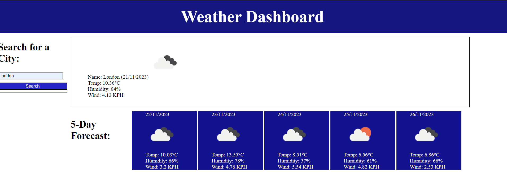

# GPweatherApp
Weather Application.

This project it's a weather application that can help you plan your day depending on the weather ahead. The motivation of this project was to create a simple but efective weather application.

## Installation.

For the installation of the program, you'd only need to click on the link below: 

https://m4r1an24.github.io/GPweatherApp/

This link will take you to the calendar and there you can simply use it.

Here's a screenshot of what you should see: 

## Deployment 

For the deployment of the website, you'll only have to click on the link above and use it on an acceptable browser.

## Built with

This project was build with HTML, CSS, JavaScript, jQuery, Web API.

## Authors

Gabriel Pamfil and with the assistance of John Titus and AskBCS.

## License

MIT

## Acknowledgments

John Titus / AskBCS - Instructor which helped me with inspiration for the code and debugging. 